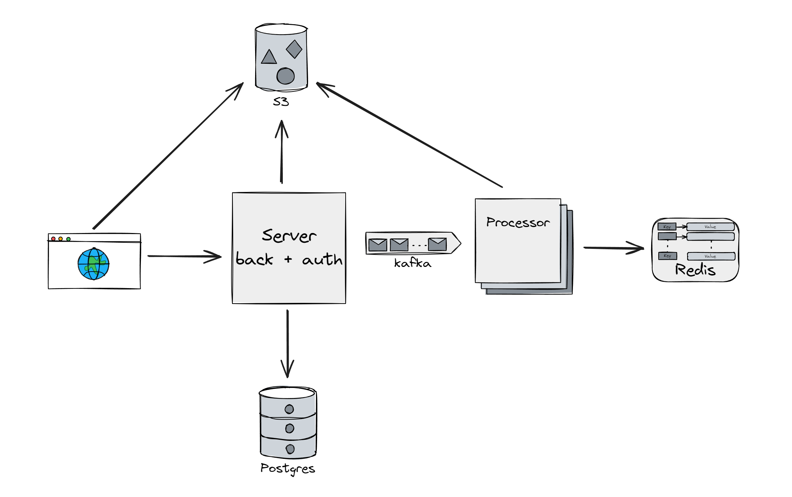

# Graduation Project 2: Image Upscale Infrastructure

## Brief Description
Infrastructure for file processing via a web interface using Kafka and S3. The image processing method is upscale using a pre-built program.

### Use Case
- The user visits the website, where the homepage displays a container for dragging and dropping images and a task queue table.
- The user drags (or opens) several images.
- Images are uploaded to the server and added to the processing queue in the table.
- The website periodically updates the queue data.
- If an image is processed, a download link becomes available in the table for that image.
- The user is automatically logged in to the website using a JWT token.

## Task

### Backend
- Serves the website homepage through a file server.
- Ensures file uploads to S3 storage.
- Creates tasks in the database and sends them to the message broker.
- Monitors task execution and provides the user with information about the task's position in the queue.
- Provides user authentication via JWT tokens.

### Task Processing Microservice
- Retrieves tasks from the message queue, processes the files, and sends the result back to the message queue.
- Can be launched in multiple instances for scaling.
- Uses the Real-ESRGAN utility to upscale images.

## Architecture

### Architecture Diagram

## API

### Description

#### `/api/user/getuploadurls`
Get URLs for uploading files to S3 storage.

#### `/api/user/complefilesupload`
Confirm that files have been uploaded and start processing.

#### `/api/user/getstate`
Get the current task state, including the queue.

#### `/api/auth/login`
User login and JWT token retrieval.
